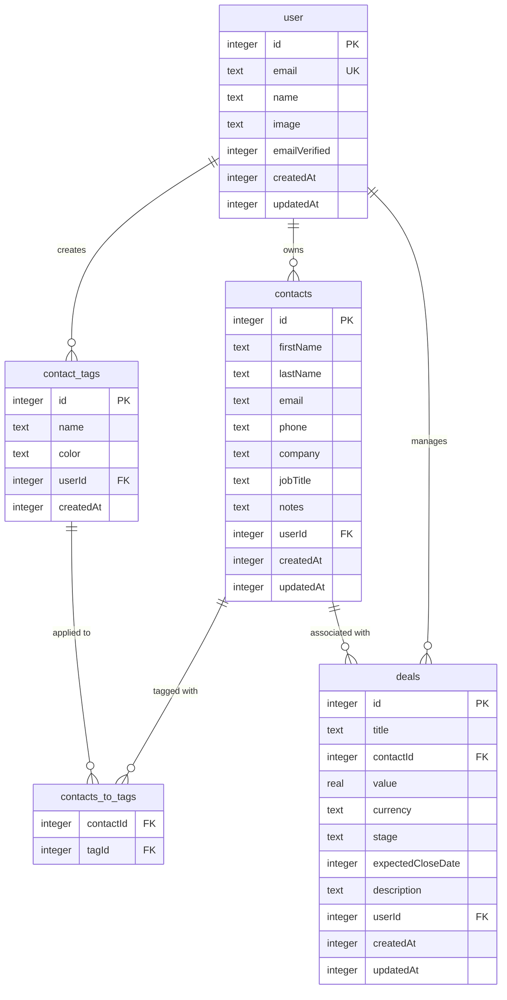

# Database Schema: Fullstack Next.js + Cloudflare CRM

**Database**: Cloudflare D1 (distributed SQLite)
**Migrations**: Located in `drizzle/`
**ORM**: Drizzle ORM
**Schema Files**: `src/modules/*/schemas/*.schema.ts`

---

## Overview

The CRM extends the existing template database (users, sessions, todos, categories) with 4 new tables for contacts and deals management.

**Existing Tables** (from template):
- `user` - User accounts (Better Auth)
- `session` - Active sessions (Better Auth)
- `account` - OAuth provider accounts (Better Auth)
- `verification` - Email verification tokens (Better Auth)
- `todos` - Task management
- `categories` - Todo categories

**New CRM Tables** (added in Phase 2):
- `contacts` - Contact profiles
- `contact_tags` - User-defined tags
- `contacts_to_tags` - Many-to-many junction table
- `deals` - Sales pipeline deals

---

## Entity Relationship Diagram



---

## Table Definitions

### `contacts`

**Purpose**: Store contact information for CRM

| Column | Type | Constraints | Notes |
|--------|------|-------------|-------|
| id | INTEGER | PRIMARY KEY AUTOINCREMENT | Unique contact ID |
| firstName | TEXT | | Optional - at least one name required |
| lastName | TEXT | | Optional - at least one name required |
| email | TEXT | | Optional but must be valid format |
| phone | TEXT | | Optional, freeform (no format validation) |
| company | TEXT | | Optional company name |
| jobTitle | TEXT | | Optional job title/role |
| notes | TEXT | | Optional freeform notes |
| userId | INTEGER | NOT NULL, FOREIGN KEY → user(id) | Owner of contact |
| createdAt | INTEGER | NOT NULL | Unix timestamp (milliseconds) |
| updatedAt | INTEGER | NOT NULL | Unix timestamp (milliseconds) |

**Indexes**:
- `idx_contacts_user_id` on `userId` (filter by user)
- `idx_contacts_email` on `email` (search by email)
- `idx_contacts_company` on `company` (search by company)

**Relationships**:
- Many-to-one with `user` (each contact owned by one user)
- Many-to-many with `contact_tags` (via junction table)
- One-to-many with `deals` (contact can have multiple deals)

**Business Rules**:
- At least one of `firstName` or `lastName` must be non-empty (enforced in app, not DB)
- Email must be unique per user (optional constraint, not enforced in MVP)
- Deleting a user cascades to delete their contacts

---

### `contact_tags`

**Purpose**: User-defined tags for organizing contacts

| Column | Type | Constraints | Notes |
|--------|------|-------------|-------|
| id | INTEGER | PRIMARY KEY AUTOINCREMENT | Unique tag ID |
| name | TEXT | NOT NULL | Tag name (e.g., "Customer", "Lead") |
| color | TEXT | NOT NULL | Hex color code (e.g., "#3B82F6") |
| userId | INTEGER | NOT NULL, FOREIGN KEY → user(id) | Tag owner |
| createdAt | INTEGER | NOT NULL | Unix timestamp (milliseconds) |

**Indexes**:
- `idx_contact_tags_user_id` on `userId` (filter by user)
- `idx_contact_tags_name_user` on `(name, userId)` (prevent duplicate tag names per user)

**Relationships**:
- Many-to-one with `user` (each tag owned by one user)
- Many-to-many with `contacts` (via junction table)

**Business Rules**:
- Tag name must be unique per user (enforced in app)
- Color must be valid hex format (enforced in app with Zod: `/^#[0-9A-Fa-f]{6}$/`)
- Deleting a tag removes all tag assignments (via cascade on junction table)

---

### `contacts_to_tags` (Junction Table)

**Purpose**: Many-to-many relationship between contacts and tags

| Column | Type | Constraints | Notes |
|--------|------|-------------|-------|
| contactId | INTEGER | FOREIGN KEY → contacts(id) ON DELETE CASCADE | Contact being tagged |
| tagId | INTEGER | FOREIGN KEY → contact_tags(id) ON DELETE CASCADE | Tag being applied |

**Composite Primary Key**: `(contactId, tagId)`

**Indexes**:
- Primary key index on `(contactId, tagId)` (prevent duplicate assignments)
- `idx_contacts_to_tags_tag_id` on `tagId` (query contacts by tag)

**Relationships**:
- Many-to-one with `contacts`
- Many-to-one with `contact_tags`

**Business Rules**:
- A contact can have multiple tags
- A tag can be applied to multiple contacts
- Same tag cannot be assigned to a contact twice (enforced by composite PK)
- Deleting a contact removes all its tag assignments (ON DELETE CASCADE)
- Deleting a tag removes all its assignments (ON DELETE CASCADE)

---

### `deals`

**Purpose**: Sales pipeline deals linked to contacts

| Column | Type | Constraints | Notes |
|--------|------|-------------|-------|
| id | INTEGER | PRIMARY KEY AUTOINCREMENT | Unique deal ID |
| title | TEXT | NOT NULL | Deal name/description |
| contactId | INTEGER | FOREIGN KEY → contacts(id) ON DELETE SET NULL | Linked contact (optional) |
| value | REAL | NOT NULL | Deal value (e.g., 5000.00) |
| currency | TEXT | NOT NULL DEFAULT 'AUD' | Currency code (ISO 4217) |
| stage | TEXT | NOT NULL | Pipeline stage (see enum below) |
| expectedCloseDate | INTEGER | | Expected close date (unix timestamp) |
| description | TEXT | | Optional deal notes |
| userId | INTEGER | NOT NULL, FOREIGN KEY → user(id) | Deal owner |
| createdAt | INTEGER | NOT NULL | Unix timestamp (milliseconds) |
| updatedAt | INTEGER | NOT NULL | Unix timestamp (milliseconds) |

**Stage Enum** (enforced in app):
- `"Prospecting"` - Initial contact
- `"Qualification"` - Evaluating fit
- `"Proposal"` - Proposal sent
- `"Negotiation"` - Negotiating terms
- `"Closed Won"` - Deal won
- `"Closed Lost"` - Deal lost

**Indexes**:
- `idx_deals_user_id` on `userId` (filter by user)
- `idx_deals_contact_id` on `contactId` (filter by contact)
- `idx_deals_stage` on `stage` (filter by pipeline stage)
- `idx_deals_user_stage` on `(userId, stage)` (pipeline board queries)

**Relationships**:
- Many-to-one with `user` (each deal owned by one user)
- Many-to-one with `contacts` (optional - deal can exist without contact)

**Business Rules**:
- Contact link is optional (`contactId` can be NULL)
- Deleting a contact does NOT delete deals (sets `contactId` to NULL)
- Stage must be one of the 6 valid enum values (enforced in app with Zod)
- Value must be positive (enforced in app)
- Currency defaults to AUD (user can change in form)
- Deleting a user cascades to delete their deals

---

## Data Types & Conventions

### Timestamps

**Storage**: INTEGER (unix timestamp in milliseconds)

**Creation**:
```typescript
const now = Date.now() // JavaScript
```

**Display**:
```typescript
new Date(timestamp).toLocaleDateString('en-AU')
new Date(timestamp).toLocaleString('en-AU')
```

**Drizzle Schema**:
```typescript
createdAt: integer('created_at', { mode: 'number' })
  .notNull()
  .$defaultFn(() => Date.now())
```

### Foreign Keys

**Syntax in Drizzle**:
```typescript
userId: integer('user_id')
  .notNull()
  .references(() => userTable.id, { onDelete: 'cascade' })
```

**Cascade Behavior**:
- `onDelete: 'cascade'` - Delete child records when parent deleted
- `onDelete: 'set null'` - Set foreign key to NULL when parent deleted

**Applied**:
- User → Contacts: CASCADE (delete user's contacts)
- User → Tags: CASCADE (delete user's tags)
- User → Deals: CASCADE (delete user's deals)
- Contact → Deals: SET NULL (keep deal, remove contact link)
- Contact → Junction: CASCADE (remove tag assignments)
- Tag → Junction: CASCADE (remove contact assignments)

### Enums

**Deal Stage** (not enforced in DB, only in app):
```typescript
export const dealStageEnum = [
  'Prospecting',
  'Qualification',
  'Proposal',
  'Negotiation',
  'Closed Won',
  'Closed Lost',
] as const

export type DealStage = typeof dealStageEnum[number]
```

**Validation in Zod**:
```typescript
stage: z.enum(dealStageEnum)
```

### Text Fields

**SQLite TEXT type** (no length limits):
- Short fields: email, phone, name, color
- Long fields: notes, description

**Encoding**: UTF-8

**Collation**: Use `COLLATE NOCASE` for case-insensitive searches:
```sql
WHERE email LIKE '%query%' COLLATE NOCASE
```

### Numeric Fields

**INTEGER**: Whole numbers (IDs, timestamps, foreign keys)
**REAL**: Floating point (deal values)

---

## Migrations

### Migration 0001: Initial Schema (Template)

**File**: `drizzle/0000_*.sql`

**Creates**:
- `user` table (Better Auth)
- `session` table (Better Auth)
- `account` table (Better Auth)
- `verification` table (Better Auth)
- `todos` table (template feature)
- `categories` table (template feature)

**Status**: Already applied (template setup)

---

### Migration 0002: CRM Schema (Phase 2)

**File**: `drizzle/0002_*.sql`

**Creates**:
- `contacts` table with indexes
- `contact_tags` table with indexes
- `contacts_to_tags` junction table with composite PK
- `deals` table with indexes

**SQL Preview**:
```sql
CREATE TABLE contacts (
  id INTEGER PRIMARY KEY AUTOINCREMENT,
  first_name TEXT,
  last_name TEXT,
  email TEXT,
  phone TEXT,
  company TEXT,
  job_title TEXT,
  notes TEXT,
  user_id INTEGER NOT NULL REFERENCES user(id) ON DELETE CASCADE,
  created_at INTEGER NOT NULL,
  updated_at INTEGER NOT NULL
);

CREATE INDEX idx_contacts_user_id ON contacts(user_id);
CREATE INDEX idx_contacts_email ON contacts(email);
CREATE INDEX idx_contacts_company ON contacts(company);

CREATE TABLE contact_tags (
  id INTEGER PRIMARY KEY AUTOINCREMENT,
  name TEXT NOT NULL,
  color TEXT NOT NULL,
  user_id INTEGER NOT NULL REFERENCES user(id) ON DELETE CASCADE,
  created_at INTEGER NOT NULL
);

CREATE INDEX idx_contact_tags_user_id ON contact_tags(user_id);
CREATE UNIQUE INDEX idx_contact_tags_name_user ON contact_tags(name, user_id);

CREATE TABLE contacts_to_tags (
  contact_id INTEGER NOT NULL REFERENCES contacts(id) ON DELETE CASCADE,
  tag_id INTEGER NOT NULL REFERENCES contact_tags(id) ON DELETE CASCADE,
  PRIMARY KEY (contact_id, tag_id)
);

CREATE INDEX idx_contacts_to_tags_tag_id ON contacts_to_tags(tag_id);

CREATE TABLE deals (
  id INTEGER PRIMARY KEY AUTOINCREMENT,
  title TEXT NOT NULL,
  contact_id INTEGER REFERENCES contacts(id) ON DELETE SET NULL,
  value REAL NOT NULL,
  currency TEXT NOT NULL DEFAULT 'AUD',
  stage TEXT NOT NULL,
  expected_close_date INTEGER,
  description TEXT,
  user_id INTEGER NOT NULL REFERENCES user(id) ON DELETE CASCADE,
  created_at INTEGER NOT NULL,
  updated_at INTEGER NOT NULL
);

CREATE INDEX idx_deals_user_id ON deals(user_id);
CREATE INDEX idx_deals_contact_id ON deals(contact_id);
CREATE INDEX idx_deals_stage ON deals(stage);
CREATE INDEX idx_deals_user_stage ON deals(user_id, stage);
```

**Apply**:
```bash
# Local
pnpm run db:migrate:local

# Production
pnpm run db:migrate
```

---

## Seed Data (Phase 6)

### Contacts

10 sample contacts with variety:
- 3 contacts with multiple tags
- 2 contacts linked to deals
- Mix of complete and minimal profiles

Example:
```typescript
{
  firstName: 'Sarah',
  lastName: 'Chen',
  email: 'sarah.chen@example.com',
  phone: '+61 412 345 678',
  company: 'TechCorp Australia',
  jobTitle: 'CTO',
  notes: 'Met at DevConf 2024. Interested in AI features.',
  userId: 1,
  createdAt: Date.now(),
  updatedAt: Date.now()
}
```

### Tags

5 common tags:
- Customer (#10B981 - green)
- Lead (#3B82F6 - blue)
- Partner (#8B5CF6 - purple)
- Inactive (#6B7280 - gray)
- VIP (#F59E0B - amber)

### Deals

5 deals across all stages:
```typescript
[
  { title: 'Enterprise License', stage: 'Prospecting', value: 5000 },
  { title: 'Consulting Package', stage: 'Qualification', value: 12000 },
  { title: 'Annual Support', stage: 'Proposal', value: 25000 },
  { title: 'Cloud Migration', stage: 'Closed Won', value: 50000 },
  { title: 'Training Program', stage: 'Closed Lost', value: 8000 },
]
```

---

## Query Patterns

### Fetch Contacts with Tags

```typescript
// Using Drizzle ORM
const contactsWithTags = await db
  .select({
    id: contacts.id,
    firstName: contacts.firstName,
    lastName: contacts.lastName,
    email: contacts.email,
    company: contacts.company,
    tags: sql`json_group_array(json_object('id', ${contactTags.id}, 'name', ${contactTags.name}, 'color', ${contactTags.color}))`,
  })
  .from(contacts)
  .leftJoin(contactsToTags, eq(contacts.id, contactsToTags.contactId))
  .leftJoin(contactTags, eq(contactsToTags.tagId, contactTags.id))
  .where(eq(contacts.userId, userId))
  .groupBy(contacts.id)
```

### Search Contacts

```typescript
// Case-insensitive search across name, email, company
const results = await db
  .select()
  .from(contacts)
  .where(
    and(
      eq(contacts.userId, userId),
      or(
        sql`${contacts.firstName} LIKE ${`%${query}%`} COLLATE NOCASE`,
        sql`${contacts.lastName} LIKE ${`%${query}%`} COLLATE NOCASE`,
        sql`${contacts.email} LIKE ${`%${query}%`} COLLATE NOCASE`,
        sql`${contacts.company} LIKE ${`%${query}%`} COLLATE NOCASE`
      )
    )
  )
```

### Fetch Deals with Contact Info

```typescript
// Join deals with contacts
const dealsWithContacts = await db
  .select({
    id: deals.id,
    title: deals.title,
    value: deals.value,
    currency: deals.currency,
    stage: deals.stage,
    contactName: sql`${contacts.firstName} || ' ' || ${contacts.lastName}`,
    contactEmail: contacts.email,
  })
  .from(deals)
  .leftJoin(contacts, eq(deals.contactId, contacts.id))
  .where(eq(deals.userId, userId))
  .orderBy(deals.createdAt)
```

### Dashboard Metrics

```typescript
// Count contacts
const totalContacts = await db
  .select({ count: sql`count(*)` })
  .from(contacts)
  .where(eq(contacts.userId, userId))

// Count active deals
const activeDeals = await db
  .select({ count: sql`count(*)` })
  .from(deals)
  .where(
    and(
      eq(deals.userId, userId),
      notInArray(deals.stage, ['Closed Won', 'Closed Lost'])
    )
  )

// Sum pipeline value
const pipelineValue = await db
  .select({ total: sql`sum(${deals.value})` })
  .from(deals)
  .where(
    and(
      eq(deals.userId, userId),
      notInArray(deals.stage, ['Closed Won', 'Closed Lost'])
    )
  )
```

---

## Performance Considerations

### Indexes

**Query Patterns**:
- Filter by userId (every query) → Index on `user_id` for all tables
- Search by email/company → Indexes on `email`, `company` in contacts
- Filter deals by stage → Index on `stage`
- Pipeline board query → Composite index on `(user_id, stage)`

**Trade-offs**:
- Indexes speed up SELECT queries
- Indexes slow down INSERT/UPDATE/DELETE (minimal impact for CRM scale)
- SQLite handles small indexes efficiently

### N+1 Query Prevention

**Anti-pattern**:
```typescript
// BAD: N+1 queries
const contacts = await getContacts(userId)
for (const contact of contacts) {
  const tags = await getTagsForContact(contact.id) // N queries!
}
```

**Solution**:
```typescript
// GOOD: Single query with JOIN
const contactsWithTags = await db
  .select()
  .from(contacts)
  .leftJoin(contactsToTags, ...)
  .leftJoin(contactTags, ...)
  .groupBy(contacts.id)
```

### Pagination

**For lists >50 items**:
```typescript
const pageSize = 50
const offset = (page - 1) * pageSize

const contacts = await db
  .select()
  .from(contacts)
  .where(eq(contacts.userId, userId))
  .limit(pageSize)
  .offset(offset)
```

**Not needed for MVP** (small data sets), but good practice for Phase 2.

---

## Security

### User Isolation

**Critical**: Every query MUST filter by `userId` to prevent data leakage.

**Pattern**:
```typescript
// Always include userId in WHERE clause
await db
  .select()
  .from(contacts)
  .where(eq(contacts.userId, currentUserId))
```

**Enforcement**:
- Server Actions use `requireAuth()` to get `currentUserId`
- Never trust client-provided `userId` parameter
- Always re-fetch user from session token

### Ownership Verification

**Before UPDATE/DELETE**:
```typescript
// 1. Fetch record
const contact = await db.query.contacts.findFirst({
  where: eq(contacts.id, contactId)
})

// 2. Verify ownership
if (contact.userId !== currentUserId) {
  throw new Error('Forbidden')
}

// 3. Mutate
await db.update(contacts).set(...).where(eq(contacts.id, contactId))
```

### SQL Injection Prevention

**Drizzle ORM handles parameterization automatically**:
```typescript
// Safe - Drizzle uses prepared statements
const results = await db
  .select()
  .from(contacts)
  .where(sql`email LIKE ${`%${userInput}%`}`)
// userInput is safely escaped
```

**Never use string concatenation**:
```typescript
// UNSAFE - DO NOT DO THIS
const query = `SELECT * FROM contacts WHERE email = '${userInput}'`
```

---

## Backup & Recovery

### Local D1 Backup

**Location**: `.wrangler/state/v3/d1/miniflare-D1DatabaseObject/*.sqlite`

**Backup command**:
```bash
cp .wrangler/state/v3/d1/miniflare-D1DatabaseObject/*.sqlite backup-$(date +%Y%m%d).sqlite
```

### Production D1 Backup

**Export**:
```bash
npx wrangler d1 export fullstack-crm --remote --output backup.sql
```

**Restore**:
```bash
npx wrangler d1 execute fullstack-crm --remote --file backup.sql
```

**Frequency**: Manual for MVP, automate with GitHub Actions for production.

---

## Future Enhancements (Phase 2)

### Activity Timeline

Add `contact_activities` table:
```sql
CREATE TABLE contact_activities (
  id INTEGER PRIMARY KEY,
  contact_id INTEGER REFERENCES contacts(id) ON DELETE CASCADE,
  type TEXT NOT NULL, -- 'call', 'email', 'meeting', 'note'
  subject TEXT,
  description TEXT,
  timestamp INTEGER NOT NULL,
  user_id INTEGER REFERENCES user(id) ON DELETE CASCADE
);
```

### Custom Deal Stages

Add `deal_stages` table (user-defined):
```sql
CREATE TABLE deal_stages (
  id INTEGER PRIMARY KEY,
  name TEXT NOT NULL,
  order_index INTEGER NOT NULL,
  color TEXT,
  user_id INTEGER REFERENCES user(id) ON DELETE CASCADE,
  UNIQUE(name, user_id)
);
```

Modify `deals.stage` to reference `deal_stages.id` instead of enum.

### Soft Delete

Add `deleted_at` column to contacts and deals:
```sql
ALTER TABLE contacts ADD COLUMN deleted_at INTEGER;
ALTER TABLE deals ADD COLUMN deleted_at INTEGER;
```

Filter deleted records: `WHERE deleted_at IS NULL`

---

## References

- **Drizzle ORM Docs**: https://orm.drizzle.team/docs/overview
- **SQLite Data Types**: https://www.sqlite.org/datatype3.html
- **D1 Documentation**: https://developers.cloudflare.com/d1/
- **Better Auth Schema**: https://www.better-auth.com/docs/concepts/database
