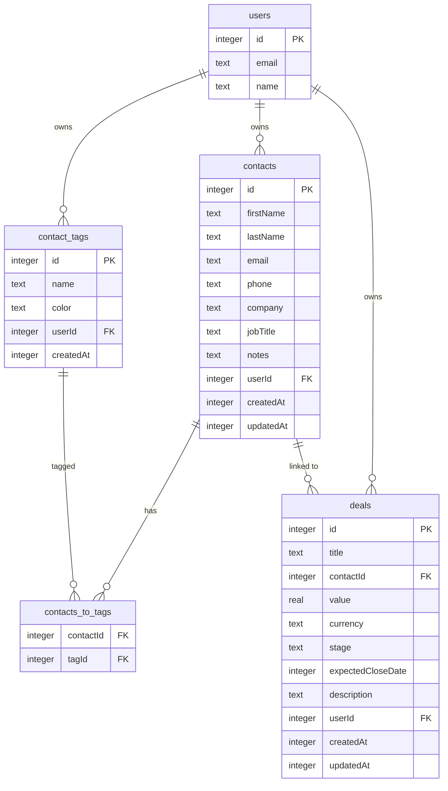
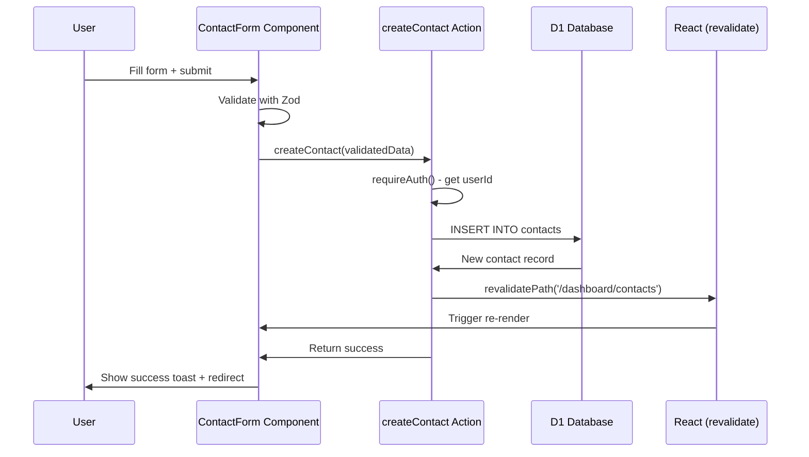
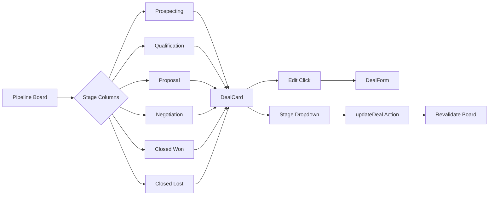
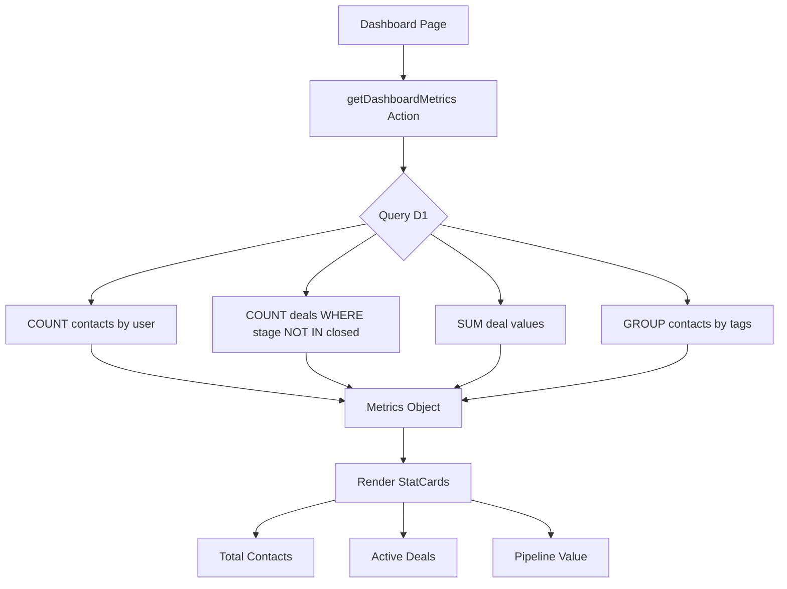

# Implementation Phases: Fullstack Next.js + Cloudflare CRM

**Project Type**: Learning Exercise - CRM Features
**Stack**: Next.js 15 + Cloudflare Workers + D1 + Drizzle ORM + Tailwind v4 + shadcn/ui
**Estimated Total**: 6-8 hours (~6-8 minutes human time with Claude Code)

---

## Phase 1: Project Setup

**Type**: Infrastructure
**Estimated**: 30 minutes
**Files**: `wrangler.jsonc`, `.dev.vars`, `package.json`

### Purpose

Clone the project to a new directory, configure Cloudflare D1 database for your account, set up environment variables, and verify the development environment works.

### File Map

- `wrangler.jsonc` (modify existing)
  - **Purpose**: Cloudflare Workers configuration
  - **Modifications**: Update D1 database ID to your account's database
  - **Used by**: Wrangler CLI for deployment and local dev

- `.dev.vars` (create new)
  - **Purpose**: Local development secrets
  - **Contains**: Better Auth secrets, Google OAuth credentials
  - **Used by**: Local development server

### Tasks

- [ ] Clone project from `/home/jez/Documents/fullstack-next-cloudflare-demo` to `/home/jez/Documents/fullstack-next-cloudflare-crm`
- [ ] Install dependencies with `pnpm install`
- [ ] Create new D1 database: `npx wrangler d1 create fullstack-crm`
- [ ] Update `wrangler.jsonc` with new database ID (replace `757a32d1-5779-4f09-bcf3-b268013395d4`)
- [ ] Create `.dev.vars` file with Better Auth secrets (copy from demo project if available)
- [ ] Run existing migrations: `pnpm run db:migrate:local`
- [ ] Start dev servers (two terminals): `pnpm run wrangler:dev` and `pnpm run dev`
- [ ] Verify app loads at http://localhost:5173
- [ ] Create git repository and initial commit

### Verification Criteria

- [ ] App loads without errors in browser
- [ ] Can navigate to /dashboard (after login)
- [ ] Existing todos feature works (proves D1 connection)
- [ ] No console errors
- [ ] Git repository initialized

### Exit Criteria

Development environment is fully functional with new D1 database configured. Can run both Wrangler and Next.js dev servers simultaneously. Existing template features work correctly.

---

## Phase 2: Database Schema

**Type**: Database
**Estimated**: 1 hour
**Files**: `src/modules/contacts/schemas/contact.schema.ts`, `src/modules/contacts/schemas/tag.schema.ts`, `src/modules/deals/schemas/deal.schema.ts`, `drizzle/0002_crm_schema.sql`

### Purpose

Create database tables for contacts, tags, and deals with proper relationships. Follows the existing pattern from `todos` and `categories` tables.

### File Map

- `src/modules/contacts/schemas/contact.schema.ts` (new ~60 lines)
  - **Purpose**: Drizzle schema for contacts table and tags
  - **Key exports**: contactsTable, contactTagsTable, contactsToTagsTable
  - **Dependencies**: drizzle-orm/d1, src/modules/auth/schemas (user relation)
  - **Used by**: Contact actions, migration generation

- `src/modules/deals/schemas/deal.schema.ts` (new ~50 lines)
  - **Purpose**: Drizzle schema for deals table
  - **Key exports**: dealsTable, dealStageEnum
  - **Dependencies**: drizzle-orm/d1, contacts schema (foreign key)
  - **Used by**: Deal actions, migration generation

- `src/db/schema.ts` (modify existing)
  - **Purpose**: Aggregate all schemas for migrations
  - **Modifications**: Export new CRM schemas
  - **Used by**: Drizzle Kit for migration generation

- `drizzle/0002_crm_schema.sql` (generated)
  - **Purpose**: Migration file to create CRM tables
  - **Creates**: contacts, contact_tags, contacts_to_tags, deals tables
  - **Generated by**: `pnpm drizzle-kit generate`

### Data Flow

### Critical Dependencies

**Internal**:
- Auth schemas (`src/modules/auth/schemas`) for user foreign keys
- Existing D1 database from Phase 1

**External**:
- `drizzle-orm` - ORM for type-safe queries
- `drizzle-kit` - Migration generation

**Configuration**:
- `drizzle.local.config.ts` - Points to local D1 database

### Gotchas & Known Issues

**Many-to-Many Pattern**:
- Junction table `contacts_to_tags` requires composite primary key `(contactId, tagId)`
- Drizzle syntax: `primaryKey: ["contactId", "tagId"]`
- Querying requires joins - study Drizzle docs for many-to-many queries

**Foreign Key Constraints**:
- SQLite (D1) supports foreign keys but they must be enabled
- Use `.onDelete("cascade")` for tags (deleting tag removes associations)
- Use `.onDelete("set null")` for deals.contactId (deleting contact keeps deal)

**Timestamp Pattern**:
- Store as INTEGER (unix timestamp in milliseconds)
- Use `.$defaultFn(() => Date.now())` for createdAt
- Use `.notNull()` for required fields

**Deal Stages as Enum**:
- Fixed stages for MVP: Prospecting, Qualification, Proposal, Negotiation, Closed Won, Closed Lost
- Stored as TEXT with enum constraint
- Phase 2 feature: Custom user-defined stages (requires separate table)

### Tasks

- [ ] Create `src/modules/contacts/schemas/` directory
- [ ] Create `contact.schema.ts` with contactsTable definition (firstName, lastName, email, phone, company, jobTitle, notes, userId, timestamps)
- [ ] Add contactTagsTable definition (id, name, color, userId, createdAt)
- [ ] Add contactsToTagsTable junction table (contactId, tagId, composite PK)
- [ ] Create `src/modules/deals/schemas/` directory
- [ ] Create `deal.schema.ts` with dealsTable definition (title, contactId FK, value, currency, stage enum, expectedCloseDate, description, userId, timestamps)
- [ ] Update `src/db/schema.ts` to export new schemas
- [ ] Generate migration: `pnpm drizzle-kit generate`
- [ ] Review generated SQL in `drizzle/0002_crm_schema.sql`
- [ ] Run migration locally: `pnpm run db:migrate:local`
- [ ] Verify tables created in D1: `npx wrangler d1 execute fullstack-crm --local --command "SELECT name FROM sqlite_master WHERE type='table'"`

### Verification Criteria

- [ ] Migration generates without errors
- [ ] Migration runs successfully (local D1)
- [ ] Can see 7 new tables in D1: contacts, contact_tags, contacts_to_tags, deals (plus existing user/session/account/verification/todos/categories)
- [ ] Foreign key constraints are correct (userId → users, contactId → contacts, tagId → contact_tags)
- [ ] Composite primary key exists on contacts_to_tags (contactId, tagId)
- [ ] Deal stage enum constraint is enforced

### Exit Criteria

All CRM database tables exist with proper relationships and constraints. Can manually insert test data via Wrangler CLI to verify schema. Migration is version-controlled and ready for production deployment.

---

## Phase 3: Contacts Module

**Type**: UI + Server Actions
**Estimated**: 2.5 hours
**Files**: See File Map (8 files total)

### Purpose

Implement complete contacts CRUD functionality with search, filtering, and tag management. Follows the existing `todos` module pattern.

### File Map

- `src/modules/contacts/actions/create-contact.action.ts` (new ~40 lines)
  - **Purpose**: Server action to create new contact
  - **Key exports**: createContact(data)
  - **Dependencies**: contact.schema.ts, getDb(), requireAuth()
  - **Returns**: Created contact or error

- `src/modules/contacts/actions/get-contacts.action.ts` (new ~60 lines)
  - **Purpose**: Server action to fetch contacts with search/filter
  - **Key exports**: getContacts(searchQuery?, tagId?)
  - **Dependencies**: contact.schema.ts, getDb(), requireAuth()
  - **Returns**: Array of contacts with tags

- `src/modules/contacts/actions/update-contact.action.ts` (new ~50 lines)
  - **Purpose**: Server action to update contact
  - **Key exports**: updateContact(id, data)
  - **Dependencies**: contact.schema.ts, getDb(), requireAuth()
  - **Returns**: Updated contact or error

- `src/modules/contacts/actions/delete-contact.action.ts` (new ~35 lines)
  - **Purpose**: Server action to delete contact
  - **Key exports**: deleteContact(id)
  - **Dependencies**: contact.schema.ts, getDb(), requireAuth()
  - **Returns**: Success boolean

- `src/modules/contacts/actions/tag-management.actions.ts` (new ~80 lines)
  - **Purpose**: Server actions for tag CRUD and assignment
  - **Key exports**: createTag(), getTags(), assignTagToContact(), removeTagFromContact()
  - **Dependencies**: tag.schema.ts, getDb(), requireAuth()
  - **Returns**: Tag operations results

- `src/modules/contacts/components/contact-form.tsx` (new ~120 lines)
  - **Purpose**: Reusable form for create/edit contact
  - **Key exports**: ContactForm component
  - **Dependencies**: React Hook Form, Zod, shadcn/ui (Input, Textarea, Button, Form), actions
  - **Used by**: New contact page, Edit contact page

- `src/modules/contacts/components/contact-card.tsx` (new ~80 lines)
  - **Purpose**: Display single contact with actions
  - **Key exports**: ContactCard component
  - **Dependencies**: shadcn/ui (Card, Badge), actions (delete, tags)
  - **Used by**: Contact list page

- `src/app/dashboard/contacts/page.tsx` (new ~90 lines)
  - **Purpose**: Contact list page with search and filter
  - **Route**: /dashboard/contacts
  - **Dependencies**: getContacts action, ContactCard, shadcn/ui (Input for search)
  - **Features**: Search by name/email/company, filter by tag

### Data Flow

### Critical Dependencies

**Internal**:
- Contact schemas from Phase 2
- Auth utilities (`src/modules/auth/utils/server.ts` - requireAuth, getCurrentUser)
- DB connection (`src/db/index.ts` - getDb)

**External**:
- `react-hook-form` - Form state management
- `zod` - Validation schemas
- `@hookform/resolvers/zod` - RHF + Zod integration
- shadcn/ui components: Card, Input, Textarea, Button, Form, Badge, Select

**Configuration**:
- None - uses existing D1 binding from Phase 1

### Gotchas & Known Issues

**Ownership Verification Critical**:
- UPDATE/DELETE must check `contact.userId === user.id`
- Without check, users can modify others' contacts (security vulnerability)
- Pattern: Fetch contact first, verify ownership, then mutate

**Search Implementation**:
- D1 (SQLite) doesn't have full-text search
- Use `LIKE` queries for MVP: `WHERE firstName LIKE '%query%' OR lastName LIKE '%query%' OR email LIKE '%query%'`
- Case-insensitive: Use `COLLATE NOCASE` in SQL
- Performance: Acceptable for <1000 contacts per user

**Many-to-Many Tag Queries**:
- Fetching contacts with tags requires LEFT JOIN on junction table
- Drizzle syntax is verbose - see examples in Drizzle docs
- Consider using `.with()` or raw SQL for complex queries

**Tag Color Validation**:
- Store as hex string (#FF5733)
- Validate format with Zod regex: `z.string().regex(/^#[0-9A-Fa-f]{6}$/)`
- Provide color picker in UI (use shadcn/ui Popover + color grid)

**Form Validation**:
- Email is optional but must be valid format if provided: `z.string().email().optional().or(z.literal(''))`
- Phone is optional and freeform (no format enforcement for MVP)
- At least one of firstName or lastName required

### Tasks

- [ ] Create actions directory and implement all 5 action files
- [ ] Create validation schemas for contact create/update (Zod)
- [ ] Implement getContacts with search and filter logic (LIKE queries + LEFT JOIN for tags)
- [ ] Implement tag CRUD actions (create, list, assign to contact, remove from contact)
- [ ] Create ContactForm component with React Hook Form + Zod validation
- [ ] Create ContactCard component with delete button and tag badges
- [ ] Create /dashboard/contacts page with search input and tag filter dropdown
- [ ] Create /dashboard/contacts/new page with ContactForm
- [ ] Create /dashboard/contacts/[id]/edit page with ContactForm (pre-filled)
- [ ] Add navigation link in dashboard layout
- [ ] Test all CRUD operations manually

### Verification Criteria

- [ ] Can create new contact with valid data (redirects to contacts list)
- [ ] Form validation catches invalid email format
- [ ] Can search contacts by firstName, lastName, email, company (case-insensitive)
- [ ] Can create new tags with name and color
- [ ] Can assign multiple tags to a contact
- [ ] Can remove tag from contact
- [ ] Can edit contact (form pre-fills with existing data)
- [ ] Can delete contact (shows confirmation, removes from list)
- [ ] Cannot edit/delete another user's contacts (403 error)
- [ ] Contact list updates immediately after create/update/delete (revalidation works)
- [ ] UI is responsive on mobile and desktop

### Exit Criteria

Complete contacts management system with CRUD, search, and tagging. Users can create, view, edit, delete, and organize contacts. All operations respect user ownership. Forms validate inputs properly. UI follows shadcn/ui design patterns.

---

## Phase 4: Deals Module

**Type**: UI + Server Actions
**Estimated**: 2 hours
**Files**: See File Map (7 files total)

### Purpose

Implement deals/pipeline management with CRUD operations, contact linking, and simple Kanban-style board view.

### File Map

- `src/modules/deals/actions/create-deal.action.ts` (new ~45 lines)
  - **Purpose**: Server action to create deal
  - **Key exports**: createDeal(data)
  - **Dependencies**: deal.schema.ts, getDb(), requireAuth()
  - **Returns**: Created deal with contact info

- `src/modules/deals/actions/get-deals.action.ts` (new ~70 lines)
  - **Purpose**: Server action to fetch deals with filters
  - **Key exports**: getDeals(stage?, contactId?)
  - **Dependencies**: deal.schema.ts, contact.schema.ts, getDb(), requireAuth()
  - **Returns**: Array of deals with JOIN to contacts table

- `src/modules/deals/actions/update-deal.action.ts` (new ~55 lines)
  - **Purpose**: Server action to update deal (including stage changes)
  - **Key exports**: updateDeal(id, data)
  - **Dependencies**: deal.schema.ts, getDb(), requireAuth()
  - **Returns**: Updated deal

- `src/modules/deals/actions/delete-deal.action.ts` (new ~35 lines)
  - **Purpose**: Server action to delete deal
  - **Key exports**: deleteDeal(id)
  - **Dependencies**: deal.schema.ts, getDb(), requireAuth()
  - **Returns**: Success boolean

- `src/modules/deals/components/deal-form.tsx` (new ~110 lines)
  - **Purpose**: Form for create/edit deal
  - **Key exports**: DealForm component
  - **Dependencies**: React Hook Form, Zod, shadcn/ui (Input, Select, Textarea), getContacts action
  - **Features**: Contact dropdown selector, currency input, date picker for expectedCloseDate

- `src/modules/deals/components/deal-card.tsx` (new ~70 lines)
  - **Purpose**: Display deal in board column
  - **Key exports**: DealCard component
  - **Dependencies**: shadcn/ui (Card, Badge), currency formatter
  - **Used by**: Pipeline board

- `src/app/dashboard/deals/page.tsx` (new ~100 lines)
  - **Purpose**: Pipeline Kanban board view
  - **Route**: /dashboard/deals
  - **Dependencies**: getDeals action, DealCard
  - **UI**: CSS Grid with 6 columns (one per stage)

### Data Flow

### Critical Dependencies

**Internal**:
- Deal schemas from Phase 2
- Contact schemas (for foreign key and dropdown)
- Auth utilities (requireAuth, getCurrentUser)
- DB connection (getDb)

**External**:
- `react-hook-form` + `zod` - Form validation
- shadcn/ui components: Card, Input, Select, Textarea, Button, Form, Badge
- Date picker: Consider shadcn/ui date picker or simple HTML date input for MVP

**Configuration**:
- None - uses existing D1 binding

### Gotchas & Known Issues

**Contact Dropdown Performance**:
- Load all user's contacts for dropdown selector
- If user has >100 contacts, consider search/filter in dropdown (use shadcn/ui Combobox instead of Select)
- For MVP, simple Select is fine

**Stage Enum Constraint**:
- Fixed stages defined in schema: `["Prospecting", "Qualification", "Proposal", "Negotiation", "Closed Won", "Closed Lost"]`
- Enforce in Zod validation AND database constraint
- Changing stage via dropdown updates deal immediately (no drag-drop for MVP)

**Currency Formatting**:
- Store value as REAL in database (e.g., 5000.00)
- Store currency as TEXT (e.g., "USD", "AUD")
- Display formatted: `new Intl.NumberFormat('en-AU', { style: 'currency', currency: 'AUD' }).format(value)`
- For MVP, default to AUD (hardcode or make it user preference in Phase 2)

**expectedCloseDate Handling**:
- Store as INTEGER unix timestamp
- Use HTML date input (returns YYYY-MM-DD string)
- Convert to timestamp: `new Date(dateString).getTime()`
- Display formatted: `new Date(timestamp).toLocaleDateString('en-AU')`

**Board Layout Without Drag-Drop**:
- Use CSS Grid: `grid-template-columns: repeat(6, 1fr)`
- Each column filters deals by stage
- To change stage: Click deal → Edit form → Change stage dropdown → Save
- Phase 2 feature: Add drag-drop with `@dnd-kit/core`

**Soft Delete for Deals**:
- Not implemented in MVP
- Hard delete is fine for learning project
- Phase 2: Add `deletedAt` column for soft delete

### Tasks

- [ ] Create actions directory and implement all 4 action files
- [ ] Create Zod schemas for deal create/update (validate currency, stage enum, dates)
- [ ] Implement getDeals with JOIN to contacts table (include contact name in results)
- [ ] Create DealForm component with contact Select dropdown (load from getContacts action)
- [ ] Add currency input field (number input + currency dropdown)
- [ ] Add expectedCloseDate field (HTML date input)
- [ ] Add stage Select dropdown with 6 options
- [ ] Create DealCard component with formatted currency, contact name, stage badge
- [ ] Create /dashboard/deals page with 6-column grid layout
- [ ] Filter deals by stage and render in appropriate column
- [ ] Create /dashboard/deals/new page with DealForm
- [ ] Create /dashboard/deals/[id]/edit page with DealForm (pre-filled)
- [ ] Add navigation link in dashboard layout
- [ ] Test all CRUD operations manually

### Verification Criteria

- [ ] Can create new deal with title, contact, value, currency, stage, expectedCloseDate
- [ ] Deal appears in correct stage column on board
- [ ] Can edit deal and change stage (moves to new column after save)
- [ ] Can delete deal (removes from board)
- [ ] Contact dropdown shows user's contacts only
- [ ] Currency displays formatted (e.g., "$5,000.00 AUD")
- [ ] expectedCloseDate displays formatted (e.g., "15/03/2025")
- [ ] Cannot edit/delete another user's deals (403 error)
- [ ] Board layout is responsive (stacks columns on mobile)
- [ ] Validation catches invalid data (negative value, invalid stage, etc.)

### Exit Criteria

Complete pipeline management system with CRUD and visual Kanban board. Users can create deals linked to contacts, track progress through stages, and view pipeline at a glance. All operations respect user ownership.

---

## Phase 5: Dashboard Integration

**Type**: UI
**Estimated**: 1 hour
**Files**: `src/app/dashboard/page.tsx`, `src/components/stat-card.tsx`, `src/modules/dashboard/actions/get-metrics.action.ts`

### Purpose

Enhance dashboard home page with CRM metrics and navigation links. Provides quick overview of contacts and deals.

### File Map

- `src/modules/dashboard/actions/get-metrics.action.ts` (new ~60 lines)
  - **Purpose**: Server action to compute CRM metrics
  - **Key exports**: getDashboardMetrics()
  - **Dependencies**: contact.schema.ts, deal.schema.ts, getDb(), requireAuth()
  - **Returns**: Object with totalContacts, activeDeals, pipelineValue, contactsByTag

- `src/components/stat-card.tsx` (new ~40 lines)
  - **Purpose**: Reusable metric display card
  - **Key exports**: StatCard component
  - **Dependencies**: shadcn/ui (Card)
  - **Props**: title, value, icon, trend (optional)

- `src/app/dashboard/page.tsx` (modify existing ~40 lines added)
  - **Purpose**: Dashboard home page
  - **Modifications**: Add CRM metrics grid, navigation cards
  - **Dependencies**: getDashboardMetrics action, StatCard

- `src/app/dashboard/layout.tsx` (modify existing ~10 lines added)
  - **Purpose**: Dashboard sidebar navigation
  - **Modifications**: Add links to /dashboard/contacts and /dashboard/deals
  - **Dependencies**: None

### Data Flow

### Critical Dependencies

**Internal**:
- Contact and deal schemas
- Auth utilities (requireAuth)
- DB connection (getDb)

**External**:
- shadcn/ui Card component
- Lucide icons for StatCard icons

**Configuration**:
- None

### Gotchas & Known Issues

**Metric Computation Performance**:
- Use COUNT(*) for counts (fast)
- Use SUM(value) for pipeline value (fast)
- Avoid fetching all records then counting in JS (slow)
- Add indexes if queries are slow: `CREATE INDEX idx_deals_user_stage ON deals(userId, stage)`

**Active Deals Definition**:
- Active = stage NOT IN ('Closed Won', 'Closed Lost')
- SQL: `SELECT COUNT(*) FROM deals WHERE userId = ? AND stage NOT IN ('Closed Won', 'Closed Lost')`

**Pipeline Value Calculation**:
- Sum only active deals (exclude closed)
- Handle multiple currencies: For MVP, assume all AUD and sum directly
- Phase 2: Convert currencies to base currency using exchange rates

**Dashboard Layout**:
- Use CSS Grid for metrics cards: `grid-template-columns: repeat(auto-fit, minmax(250px, 1fr))`
- Responsive: Cards wrap on mobile

**Navigation Cards vs Sidebar**:
- For MVP, add simple navigation links in sidebar
- Phase 2: Add quick action cards (e.g., "Add Contact" button with icon)

### Tasks

- [ ] Create getDashboardMetrics action with COUNT and SUM queries
- [ ] Compute totalContacts (all contacts for user)
- [ ] Compute activeDeals (deals with stage not Closed Won/Lost)
- [ ] Compute pipelineValue (SUM of active deal values)
- [ ] Create StatCard component with props: title, value, icon
- [ ] Modify /dashboard page to fetch metrics and render 3 StatCards
- [ ] Add CSS Grid layout for metrics cards
- [ ] Modify dashboard layout to add navigation links (Contacts, Deals)
- [ ] Add Lucide icons to sidebar links (Users icon for Contacts, Briefcase icon for Deals)
- [ ] Test metrics update after creating/deleting contacts/deals

### Verification Criteria

- [ ] Dashboard shows correct total contacts count
- [ ] Dashboard shows correct active deals count
- [ ] Dashboard shows correct pipeline value (formatted currency)
- [ ] Metrics update immediately after CRUD operations (revalidation works)
- [ ] StatCards are responsive and wrap on mobile
- [ ] Navigation links work (click Contacts → /dashboard/contacts)
- [ ] Sidebar highlights current route
- [ ] Icons render correctly

### Exit Criteria

Dashboard provides useful CRM overview with metrics. Users can navigate to contacts and deals from dashboard. Metrics accurately reflect current data and update in real-time.

---

## Phase 6: Testing & Documentation

**Type**: Testing + Documentation
**Estimated**: 1 hour
**Files**: `src/lib/seed.ts`, `docs/DATABASE_SCHEMA.md` (update), `docs/TESTING.md` (new), `README.md` (update)

### Purpose

Create seed data for testing, verify all features work end-to-end, and document the CRM implementation.

### File Map

- `src/lib/seed.ts` (new ~100 lines)
  - **Purpose**: Seed script to populate D1 with test data
  - **Key exports**: seedCRM() function
  - **Dependencies**: Contact/deal schemas, getDb()
  - **Creates**: 10 contacts, 5 tags, 5 deals across all stages

- `docs/TESTING.md` (new ~80 lines)
  - **Purpose**: Test plan and manual testing checklist
  - **Contains**: Feature checklist, edge cases, security tests

- `docs/DATABASE_SCHEMA.md` (update existing)
  - **Modifications**: Add CRM tables documentation from Phase 2
  - **Already created in Phase 2 planning** - just verify it's accurate

- `README.md` (modify existing ~30 lines added)
  - **Modifications**: Add CRM features section, setup instructions
  - **Contains**: Feature list, screenshots (optional), usage guide

### Seed Data

Create realistic test data:

**Contacts** (10 total):
- 3 with multiple tags
- 2 with deals
- 5 with just basic info
- Mix of complete and minimal profiles

**Tags** (5 total):
- "Customer" (green)
- "Lead" (blue)
- "Partner" (purple)
- "Inactive" (gray)
- "VIP" (gold)

**Deals** (5 total):
- 1 in Prospecting ($5,000)
- 1 in Qualification ($12,000)
- 1 in Proposal ($25,000)
- 1 in Closed Won ($50,000)
- 1 in Closed Lost ($8,000)

### Testing Checklist

**Contacts**:
- [ ] Create contact with all fields filled
- [ ] Create contact with only firstName
- [ ] Edit contact and change email
- [ ] Delete contact (verify deals set contactId to null)
- [ ] Search for contact by firstName
- [ ] Search for contact by email
- [ ] Search for contact by company (case-insensitive)
- [ ] Create tag and assign to contact
- [ ] Assign multiple tags to one contact
- [ ] Filter contacts by tag
- [ ] Remove tag from contact
- [ ] Delete tag (verify junction table cleaned up)

**Deals**:
- [ ] Create deal linked to contact
- [ ] Create deal with no contact (contactId null)
- [ ] Edit deal and change stage (verify moves to correct column)
- [ ] Edit deal and change contact
- [ ] Delete deal
- [ ] View pipeline board (all 6 columns visible)
- [ ] Verify currency formatting displays correctly
- [ ] Verify expectedCloseDate displays formatted

**Dashboard**:
- [ ] Metrics show correct counts
- [ ] Create contact → metric updates
- [ ] Delete deal → pipeline value updates
- [ ] Click navigation links (Contacts, Deals)

**Security**:
- [ ] Cannot view another user's contacts (if multi-user test)
- [ ] Cannot edit another user's contacts
- [ ] Cannot delete another user's deals

**UI/UX**:
- [ ] Forms validate before submit (invalid email caught)
- [ ] Success toasts appear after create/update/delete
- [ ] Responsive layout works on mobile (test at 375px width)
- [ ] No console errors in browser DevTools

### Tasks

- [ ] Create seed script in src/lib/seed.ts
- [ ] Add npm script to package.json: `"db:seed": "tsx src/lib/seed.ts"`
- [ ] Run seed script locally: `pnpm run db:seed`
- [ ] Verify seed data appears in dashboard
- [ ] Create TESTING.md with manual test checklist
- [ ] Run through entire test checklist, check off items
- [ ] Fix any bugs found during testing
- [ ] Update README.md with CRM features section
- [ ] Add setup instructions for new developers
- [ ] Verify docs/DATABASE_SCHEMA.md is complete
- [ ] Take screenshots of key pages (optional but helpful)
- [ ] Create git commit for all testing/docs changes

### Verification Criteria

- [ ] Seed script runs without errors
- [ ] All 10 contacts, 5 tags, 5 deals created
- [ ] All items in testing checklist pass
- [ ] No console errors during testing
- [ ] README.md accurately describes CRM features
- [ ] TESTING.md documents all test cases
- [ ] Documentation is ready for handoff/deployment

### Exit Criteria

All CRM features tested and verified working. Seed data available for demos. Documentation complete and accurate. Project ready for deployment or Phase 2 feature additions.

---

## Notes

### Testing Strategy

**Per-phase verification** (inline): Each phase has verification criteria that must pass before moving to next phase. This catches issues early.

**Final testing phase** (Phase 6): Comprehensive end-to-end testing with seed data. Ensures all features work together and no integration issues.

### Deployment Strategy

**Local development first** (all 6 phases): Build and test everything locally before deploying to Cloudflare.

**Deploy when ready**: After Phase 6 verification passes:
1. Create production D1 database: `npx wrangler d1 create fullstack-crm`
2. Update wrangler.jsonc with production database ID
3. Run production migrations: `pnpm run db:migrate`
4. Deploy: `pnpm run build && npx wrangler deploy`
5. Set up GitHub Actions for future deployments (optional)

### Context Management

**Phases are sized for single sessions**:
- Phase 1-2: Quick setup (can do together)
- Phase 3: Largest phase (~2.5 hours), may need context clear mid-phase
- Phase 4-6: Moderate phases (can each fit in one session)

**If context gets full mid-phase**:
- Use SESSION.md to track current task (see Session Handoff Protocol)
- Create git checkpoint commit
- Resume from SESSION.md after context clear

### Phase 2 Feature Ideas

After MVP is complete, consider adding:
- **Activity Timeline**: Log calls, meetings, emails on contacts
- **Avatar Uploads**: R2 storage for contact photos (reuse todos pattern)
- **Custom Deal Stages**: User-defined pipeline stages (requires new table)
- **Drag-and-Drop Kanban**: Use `@dnd-kit/core` for pipeline board
- **Advanced Search**: Full-text search with Vectorize (semantic search)
- **Email Integration**: Cloudflare Email Routing + Resend for sending
- **Export/Import**: CSV export of contacts/deals
- **Analytics Dashboard**: Charts with Recharts (conversion rates, pipeline trends)
