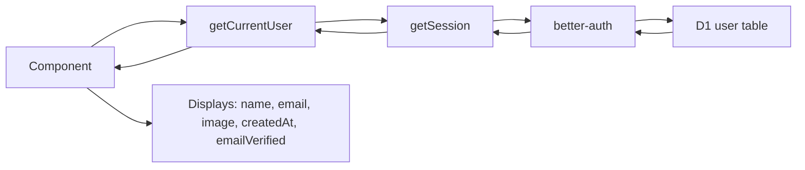
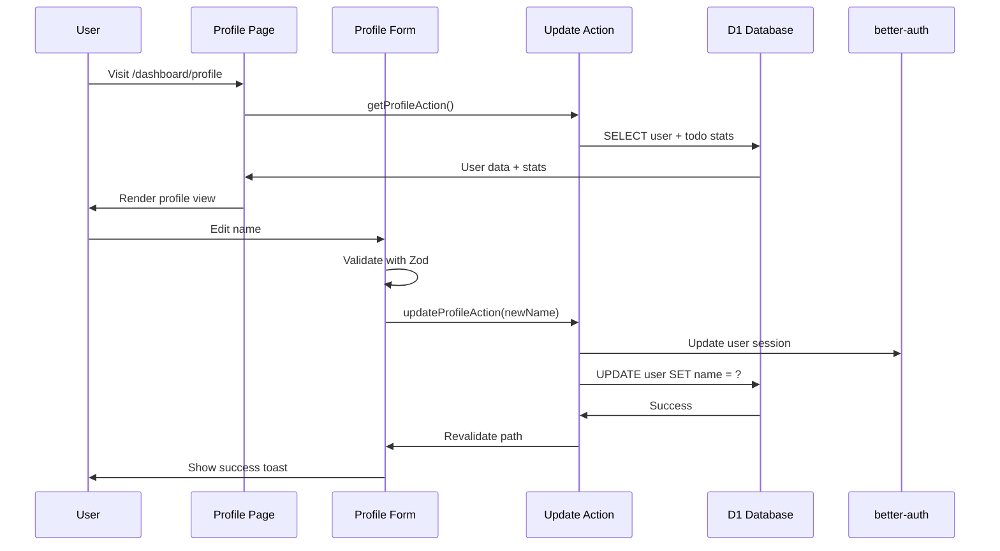
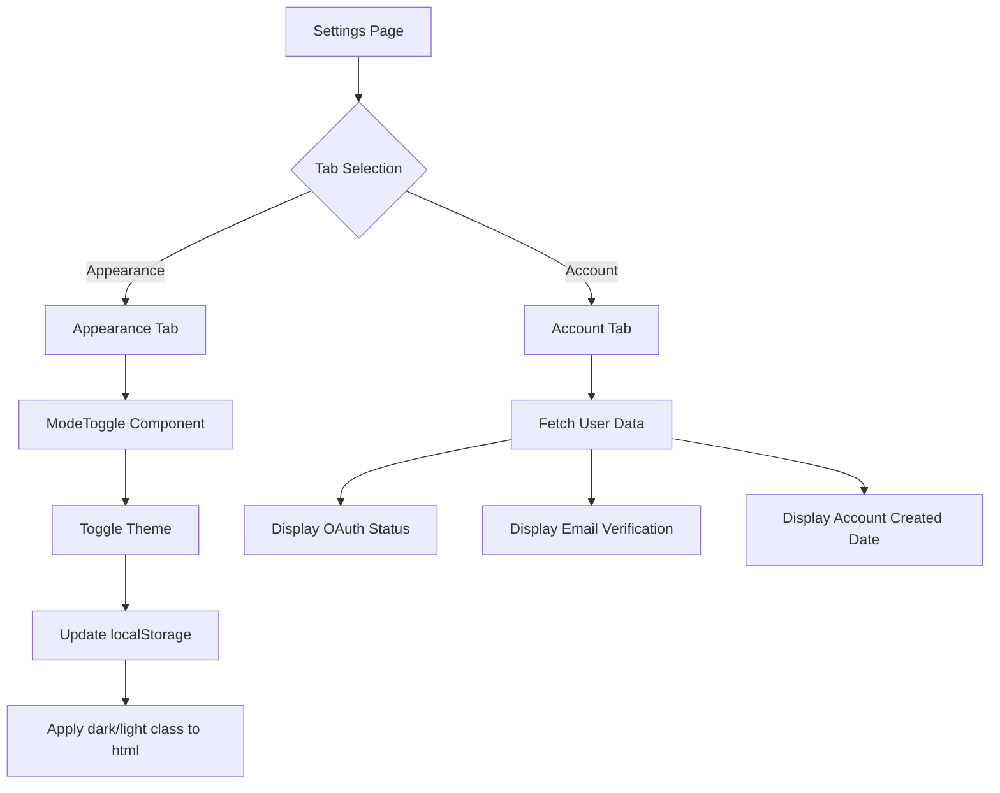
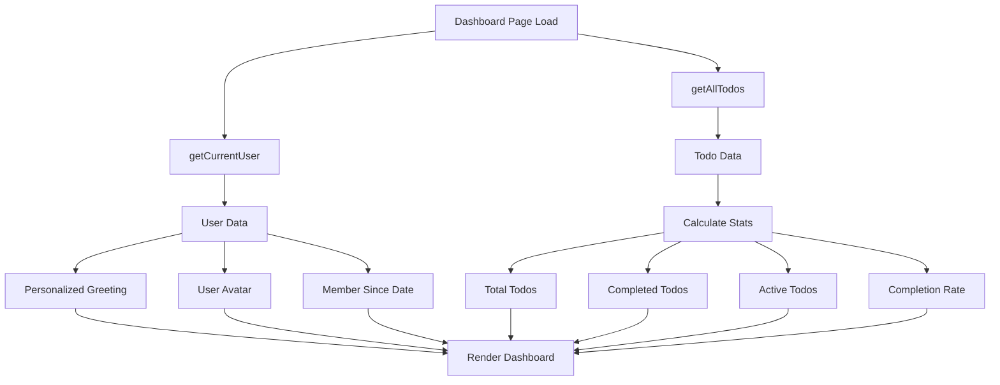

# Implementation Phases: User Profile & Settings Enhancement

**Project**: Full Flare Stack - Profile/Settings/Dashboard Enhancement
**Type**: Feature Enhancement
**Stack**: Next.js 15 + Cloudflare Workers + D1 + better-auth
**Estimated Total**: 4-5 hours (~4-5 minutes human time)
**Status**: Planning Complete

---

## Overview

Enhance the Full Flare Stack template with complete user profile management, settings, and personalized dashboard features. Build on existing better-auth integration and D1 user schema.

**Key Decisions**:
- ✅ Use Google OAuth profile images (no R2 upload yet - see GitHub issue)
- ✅ Profile editing: Name only
- ✅ Settings: Theme toggle + account info (minimal)
- ✅ Theme storage: localStorage (already working)
- ✅ Dashboard stats: Basic (total, completed, active, completion %)
- ✅ No database migrations needed (all fields exist)

---

## Phase 1: Extend Auth Model & Utils

**Type**: Infrastructure
**Estimated**: 30 minutes
**Files**: `src/modules/auth/models/user.model.ts`, `src/modules/auth/utils/auth-utils.ts`

### File Map

- `src/modules/auth/models/user.model.ts` (modify ~10 lines)
  - **Purpose**: Extend AuthUser interface to include all user fields
  - **Key exports**: AuthUser interface
  - **Used by**: All auth-related components, profile page, settings page

- `src/modules/auth/utils/auth-utils.ts` (modify ~15 lines)
  - **Purpose**: Update getSession() to return extended user data
  - **Key exports**: getCurrentUser(), requireAuth(), getSession()
  - **Dependencies**: better-auth, user.model.ts
  - **Used by**: All pages needing user data

### Data Flow



### Critical Dependencies

**Internal**: better-auth configuration, D1 user schema
**External**: better-auth package
**Database**: user table (all fields already exist)
**Environment**: BETTER_AUTH_SECRET, BETTER_AUTH_URL

### Gotchas & Known Issues

**Type Safety Critical**:
- AuthUser interface must match D1 schema exactly
- Better-auth returns `emailVerified` as boolean, but D1 stores as integer (0/1)
- Need to convert: `emailVerified: Boolean(session.user.emailVerified)`

**Date Handling**:
- D1 stores timestamps as INTEGER (unix timestamp)
- Better-auth returns Date objects
- Use `new Date(timestamp)` for display

**Image Field**:
- Can be null if user signed up with email/password
- Always check for null before rendering avatar
- Fallback to user initials in Avatar component

### Tasks

- [ ] Update `AuthUser` interface in `user.model.ts` to include:
  - `image: string | null`
  - `emailVerified: boolean`
  - `createdAt: Date`
  - `updatedAt: Date`
- [ ] Modify `getSession()` in `auth-utils.ts` to return all user fields
- [ ] Add type conversion for `emailVerified` (integer → boolean)
- [ ] Add type conversion for timestamps (integer → Date)
- [ ] Test getCurrentUser() returns complete user data

### Verification Criteria

- [ ] `getCurrentUser()` returns object with all 7 fields (id, name, email, image, emailVerified, createdAt, updatedAt)
- [ ] `image` field correctly returns Google OAuth avatar URL or null
- [ ] `emailVerified` is boolean (not integer)
- [ ] `createdAt` is Date object (not unix timestamp)
- [ ] No TypeScript errors in auth utilities

### Exit Criteria

AuthUser model includes all user fields with correct types. Auth utilities return complete user data. Type conversions handle D1 integer fields correctly.

---

## Phase 2: Profile Module (Complete Feature)

**Type**: UI + API
**Estimated**: 1.5-2 hours
**Files**: 6 new files + 2 routes

### File Map

- `src/modules/profile/profile.page.tsx` (~150 lines)
  - **Purpose**: Main profile page (server component)
  - **Key exports**: default export (page component)
  - **Dependencies**: get-profile.action, profile components
  - **Used by**: /dashboard/profile route

- `src/modules/profile/actions/get-profile.action.ts` (~30 lines)
  - **Purpose**: Fetch current user profile with todo stats
  - **Key exports**: getProfileAction (server action)
  - **Dependencies**: auth-utils, todos actions
  - **Used by**: profile.page.tsx

- `src/modules/profile/actions/update-profile.action.ts` (~60 lines)
  - **Purpose**: Update user name with validation
  - **Key exports**: updateProfileAction (server action)
  - **Dependencies**: auth-utils, db, profile.schema, better-auth
  - **Used by**: profile-form.tsx

- `src/modules/profile/schemas/profile.schema.ts` (~25 lines)
  - **Purpose**: Zod validation for profile updates
  - **Key exports**: updateProfileSchema
  - **Dependencies**: zod
  - **Used by**: update-profile.action, profile-form

- `src/modules/profile/components/profile-form.tsx` (~120 lines)
  - **Purpose**: Edit name form with validation
  - **Key exports**: ProfileForm component
  - **Dependencies**: react-hook-form, profile.schema, update-profile.action, shadcn/ui components
  - **Used by**: profile.page.tsx

- `src/modules/profile/components/profile-info.tsx` (~80 lines)
  - **Purpose**: Display-only user info card
  - **Key exports**: ProfileInfo component
  - **Dependencies**: user.model, shadcn/ui components
  - **Used by**: profile.page.tsx

- `src/modules/profile/components/profile-stats.tsx` (~60 lines)
  - **Purpose**: Todo stats card
  - **Key exports**: ProfileStats component
  - **Dependencies**: shadcn/ui components
  - **Used by**: profile.page.tsx

- `src/app/dashboard/profile/page.tsx` (route, ~5 lines)
  - **Purpose**: Next.js route wrapper
  - **Key exports**: default export
  - **Dependencies**: profile.page.tsx from module
  - **Used by**: Next.js routing

- `src/modules/layouts/components/user-nav.tsx` (modify ~3 lines)
  - **Purpose**: Wire up Profile link in dropdown
  - **Modification**: Change Profile DropdownMenuItem to use Link with href="/dashboard/profile"
  - **Used by**: Dashboard layout

### Data Flow



### Critical Dependencies

**Internal**: auth-utils, user.model, db connection
**External**: react-hook-form, zod, sonner (toast)
**shadcn/ui**: Form, Input, Button, Card, Avatar, Badge, Separator
**Configuration**: None (uses session data)
**Database**: user table, todos table (for stats)

### Gotchas & Known Issues

**Name Validation**:
- Must validate on server even though client validates (security)
- Min 1 character, max 100 characters
- Trim whitespace before saving
- Check for empty string after trim

**Session Update After Name Change**:
- After updating name in D1, must update better-auth session
- Otherwise old name shows in dropdown until next login
- Pattern: `await auth.updateUser({ userId, name })`

**Todo Stats Query**:
- Join user with todos table
- Count total, completed, active
- Handle case where user has 0 todos (don't show stats card)

**Avatar Fallback**:
- If `user.image` is null, Avatar component falls back to initials
- Initials from name: "John Doe" → "JD"
- If name is single word, use first 2 letters: "John" → "JO"

**Revalidation After Update**:
- Must call `revalidatePath('/dashboard/profile')` after update
- Otherwise old name shows until hard refresh
- Also revalidate '/dashboard' if name shows there

### Tasks

- [ ] Create profile module structure (`src/modules/profile/`)
- [ ] Create Zod schema for profile updates (name validation)
- [ ] Implement getProfileAction (fetch user + todo stats)
- [ ] Implement updateProfileAction (update name + session)
- [ ] Create ProfileForm component (react-hook-form + Zod)
- [ ] Create ProfileInfo component (display-only fields)
- [ ] Create ProfileStats component (todo statistics)
- [ ] Create profile.page.tsx (combine all components)
- [ ] Create Next.js route at /dashboard/profile
- [ ] Update user-nav.tsx to link Profile menu item
- [ ] Test profile page loads with correct data
- [ ] Test name update form with validation
- [ ] Test success toast after update
- [ ] Test profile page with user who has 0 todos

### Verification Criteria

- [ ] Profile page loads at /dashboard/profile
- [ ] Displays user name, email, Google OAuth avatar
- [ ] Shows email verification badge (verified/unverified)
- [ ] Shows account created date (formatted)
- [ ] Shows todo stats (total, completed, active)
- [ ] Edit name form validates input (min 1, max 100 chars)
- [ ] Submit with valid name updates successfully
- [ ] Submit with invalid name shows validation error
- [ ] Name updates immediately in dropdown menu (no refresh needed)
- [ ] Success toast shows after update
- [ ] Profile link in dropdown menu works
- [ ] Page is responsive (works on mobile)

### Exit Criteria

Complete profile page with view and edit functionality. Users can update their name with validation. Profile displays all user info, account status, and todo statistics. Dropdown menu links to profile page.

---

## Phase 3: Settings Module (Theme + Account Info)

**Type**: UI
**Estimated**: 1-1.5 hours
**Files**: 4 new files + 2 routes

### File Map

- `src/modules/settings/settings.page.tsx` (~80 lines)
  - **Purpose**: Main settings page with tabs
  - **Key exports**: default export (page component)
  - **Dependencies**: settings components
  - **Used by**: /dashboard/settings route

- `src/modules/settings/components/appearance-tab.tsx` (~60 lines)
  - **Purpose**: Theme toggle section
  - **Key exports**: AppearanceTab component
  - **Dependencies**: ModeToggle component, shadcn/ui
  - **Used by**: settings.page.tsx

- `src/modules/settings/components/account-tab.tsx` (~90 lines)
  - **Purpose**: Connected accounts and verification status
  - **Key exports**: AccountTab component
  - **Dependencies**: user.model, shadcn/ui
  - **Used by**: settings.page.tsx

- `src/app/dashboard/settings/page.tsx` (route, ~5 lines)
  - **Purpose**: Next.js route wrapper
  - **Key exports**: default export
  - **Dependencies**: settings.page.tsx from module
  - **Used by**: Next.js routing

- `src/modules/layouts/components/user-nav.tsx` (modify ~3 lines)
  - **Purpose**: Wire up Settings link in dropdown
  - **Modification**: Change Settings DropdownMenuItem to use Link with href="/dashboard/settings"
  - **Used by**: Dashboard layout

### Data Flow



### Critical Dependencies

**Internal**: auth-utils, user.model, ModeToggle component
**External**: None (uses existing components)
**shadcn/ui**: Tabs, Card, Badge, Separator, Label
**Configuration**: None (theme stored in localStorage)
**Existing Components**: ModeToggle (from layouts module)

### Gotchas & Known Issues

**ModeToggle Integration**:
- ModeToggle component already exists in `src/modules/layouts/components/mode-toggle.tsx`
- Don't duplicate - import and reuse
- ModeToggle handles localStorage and theme switching automatically
- No server action needed (client-side only)

**Theme Persistence**:
- Theme is stored in localStorage as `"theme": "light" | "dark" | "system"`
- ModeToggle component uses ThemeProvider context
- No need to sync with database (localStorage is sufficient)

**Connected Accounts**:
- Better-auth stores OAuth connections in `account` table
- Check if user has Google OAuth account: `SELECT * FROM account WHERE user_id = ? AND provider = 'google'`
- Show "Connected via Google" with checkmark icon
- In future: Can add "Disconnect" button (requires better-auth API call)

**Email Verification Badge**:
- Use Badge component with variant based on status
- Verified: `<Badge variant="default">Verified ✓</Badge>`
- Unverified: `<Badge variant="secondary">Not Verified</Badge>`

**Account Created Date**:
- Format: "Member since January 2024"
- Use: `new Intl.DateTimeFormat('en-US', { month: 'long', year: 'numeric' }).format(user.createdAt)`

### Tasks

- [ ] Create settings module structure (`src/modules/settings/`)
- [ ] Create settings.page.tsx with Tabs component
- [ ] Create AppearanceTab component
- [ ] Import and integrate existing ModeToggle component
- [ ] Add description text for theme options
- [ ] Create AccountTab component
- [ ] Query account table for Google OAuth connection
- [ ] Display OAuth provider with status badge
- [ ] Display email verification badge
- [ ] Display account created date (formatted)
- [ ] Create Next.js route at /dashboard/settings
- [ ] Update user-nav.tsx to link Settings menu item
- [ ] Test tab switching works
- [ ] Test theme toggle changes theme immediately
- [ ] Test OAuth status displays correctly

### Verification Criteria

- [ ] Settings page loads at /dashboard/settings
- [ ] Tabs display: Appearance and Account
- [ ] Tabs switch without page reload
- [ ] Appearance tab shows current theme selection
- [ ] Theme toggle changes theme immediately (light/dark/system)
- [ ] Theme persists after page refresh
- [ ] Account tab shows Google OAuth connection status
- [ ] Email verification badge displays correct state
- [ ] Account created date formatted correctly
- [ ] Settings link in dropdown menu works
- [ ] Page is responsive (works on mobile)

### Exit Criteria

Complete settings page with Appearance and Account tabs. Theme toggle integrates existing ModeToggle component. Account tab displays OAuth status, email verification, and account age. Dropdown menu links to settings page.

---

## Phase 4: Enhanced Dashboard (Personalization)

**Type**: UI
**Estimated**: 30-45 minutes
**Files**: 1 modification

### File Map

- `src/modules/dashboard/dashboard.page.tsx` (modify ~50 lines)
  - **Purpose**: Add personalized greeting and user stats
  - **Modifications**:
    - Import getCurrentUser() and fetch user data
    - Replace generic "Welcome to Full Flare Stack" with "Welcome back, [Name]!"
    - Add user avatar next to greeting
    - Add user stats card (total/completed/active todos, member since)
  - **Dependencies**: auth-utils, todos actions, shadcn/ui
  - **Used by**: /dashboard route

### Data Flow



### Critical Dependencies

**Internal**: auth-utils (getCurrentUser), todos actions (getAllTodos)
**External**: None
**shadcn/ui**: Card, Avatar, Progress (already used)
**Configuration**: None
**Existing**: Progress bar already exists (just add more stats)

### Gotchas & Known Issues

**Stats Calculation**:
- Use existing getAllTodos() action (already fetches all user todos)
- Total: `todos.length`
- Completed: `todos.filter(t => t.completed).length`
- Active: `total - completed`
- Completion rate: `(completed / total) * 100` (handle division by zero)

**User Avatar Placement**:
- Place avatar to left of greeting text
- Use size="lg" for dashboard (bigger than dropdown)
- Maintain responsive layout (stack on mobile)

**Greeting Personalization**:
- Use first name only: "Welcome back, John!" not "Welcome back, John Doe!"
- Extract first name: `user.name.split(' ')[0]`
- Fallback to email if name is null (shouldn't happen with OAuth)

**Stats Card Layout**:
- Place below greeting, above existing action cards
- Show only if user has todos (hide if 0 todos)
- Use existing Progress component for visual completion bar

**Maintain Existing Features**:
- Keep all existing action cards (View Todos, Create Todo, Layout Demos, AI Demo)
- Keep existing features section at bottom
- Only add to top section (greeting + stats)

### Tasks

- [ ] Import getCurrentUser() in dashboard.page.tsx
- [ ] Fetch user data at top of component
- [ ] Replace generic "Welcome to Full Flare Stack" heading
- [ ] Add personalized "Welcome back, [FirstName]!" with user avatar
- [ ] Calculate todo stats (total, completed, active, completion rate)
- [ ] Create user stats card above existing action cards
- [ ] Display member since date in stats card
- [ ] Conditionally show stats card only if user has todos
- [ ] Maintain all existing dashboard features
- [ ] Test dashboard shows correct user name
- [ ] Test stats are accurate
- [ ] Test responsive layout (mobile/desktop)

### Verification Criteria

- [ ] Dashboard shows "Welcome back, [FirstName]!" instead of generic message
- [ ] User avatar displays next to greeting
- [ ] Stats card shows total todos
- [ ] Stats card shows completed todos
- [ ] Stats card shows active todos
- [ ] Stats card shows completion rate percentage
- [ ] Stats card shows "Member since [Date]"
- [ ] Stats card hidden when user has 0 todos
- [ ] All existing action cards still display
- [ ] All existing features section still displays
- [ ] Progress bar still works correctly
- [ ] Layout is responsive (stacks on mobile)

### Exit Criteria

Dashboard is personalized with user greeting, avatar, and stats. Shows todo completion metrics and account age. Maintains all existing functionality. Responsive design works on all screen sizes.

---

## Phase 5: Testing & Deployment

**Type**: Testing
**Estimated**: 30 minutes
**Files**: None (manual testing)

### Testing Checklist

**Profile Page**:
- [ ] Visit /dashboard/profile
- [ ] Verify all user data displays correctly
- [ ] Edit name to valid value → success
- [ ] Edit name to empty string → validation error
- [ ] Edit name to 101 characters → validation error
- [ ] Verify name updates in dropdown immediately
- [ ] Verify success toast appears
- [ ] Verify todo stats are accurate
- [ ] Test with user who has 0 todos

**Settings Page**:
- [ ] Visit /dashboard/settings
- [ ] Switch between Appearance and Account tabs
- [ ] Toggle theme to dark → theme changes
- [ ] Toggle theme to light → theme changes
- [ ] Toggle theme to system → follows system preference
- [ ] Refresh page → theme persists
- [ ] Verify Google OAuth connection displays
- [ ] Verify email verification badge shows correct state
- [ ] Verify account created date is correct

**Dashboard**:
- [ ] Visit /dashboard
- [ ] Verify personalized greeting shows correct name
- [ ] Verify avatar displays (or initials if no image)
- [ ] Verify stats card shows correct todo counts
- [ ] Verify completion rate calculation is correct
- [ ] Verify member since date displays
- [ ] Create new todo → verify stats update
- [ ] Complete a todo → verify stats update
- [ ] Test with user who has 0 todos → stats card hidden

**Dropdown Menu**:
- [ ] Click avatar in top-right
- [ ] Verify Profile link goes to /dashboard/profile
- [ ] Verify Settings link goes to /dashboard/settings
- [ ] Verify Logout still works

**Responsive Design**:
- [ ] Test all pages on mobile viewport (375px width)
- [ ] Test all pages on tablet viewport (768px width)
- [ ] Test all pages on desktop viewport (1440px width)
- [ ] Verify no horizontal scroll
- [ ] Verify text is readable at all sizes

**Edge Cases**:
- [ ] User with null image (email/password signup) → initials show
- [ ] User with unverified email → badge shows "Not Verified"
- [ ] User with 0 todos → stats card hidden on dashboard
- [ ] Very long user name (50+ chars) → truncates properly

### Build & Deploy

```bash
# 1. TypeScript check
pnpm exec tsc --noEmit

# 2. Build for Cloudflare
pnpm run build:cf

# 3. Deploy with wrangler (NOT pnpm run deploy)
wrangler deploy

# 4. Test on production URL
# Visit: https://fullflarestack.jezweb.ai/dashboard/profile
```

### Verification Criteria

- [ ] No TypeScript errors
- [ ] Build succeeds without warnings
- [ ] Deploy succeeds
- [ ] All features work on production URL
- [ ] No console errors in browser DevTools
- [ ] All links work correctly
- [ ] Forms submit successfully
- [ ] Theme toggle persists correctly

### Exit Criteria

All manual tests pass. Production deployment successful. No console errors. All features work as expected on live URL.

---

## Notes

### Testing Strategy
Manual testing only (per project standards). Focus on user flows and edge cases. Test responsive design at multiple breakpoints.

### Deployment Strategy
Deploy once after all phases complete. Test thoroughly on local dev first. Use `wrangler deploy` directly (not `pnpm run deploy`).

### Context Management
Phases sized to fit in single session with verification. Each phase is independently testable. Can stop after any phase and resume later using SESSION.md.

### Future Enhancements
See GitHub issues for:
- R2 profile image upload
- Data export (JSON/CSV)
- Delete account functionality
- Theme preference sync across devices
- Advanced dashboard stats (time-based, categories, gamification)

---

## Summary

**Total Phases**: 5
**Estimated Duration**: 4-5 hours (~4-5 minutes human time)
**Database Changes**: None (all fields exist)
**New Routes**: 2 (/dashboard/profile, /dashboard/settings)
**New Modules**: 2 (profile, settings)
**Modified Modules**: 2 (auth, dashboard)
**shadcn/ui Components Used**: Tabs, Form, Input, Button, Card, Avatar, Badge, Separator, Label (all already installed)
